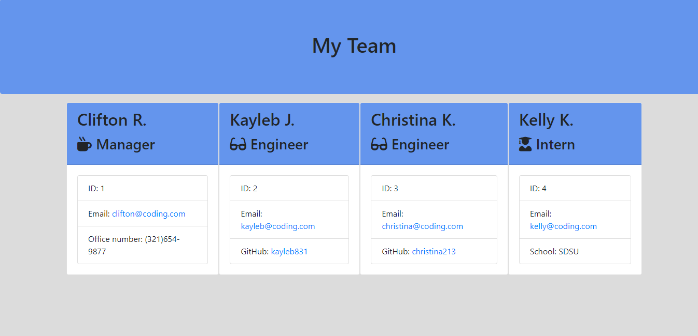
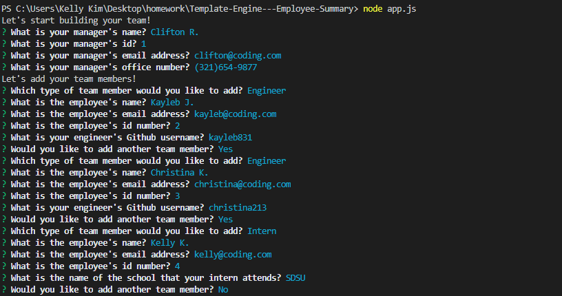
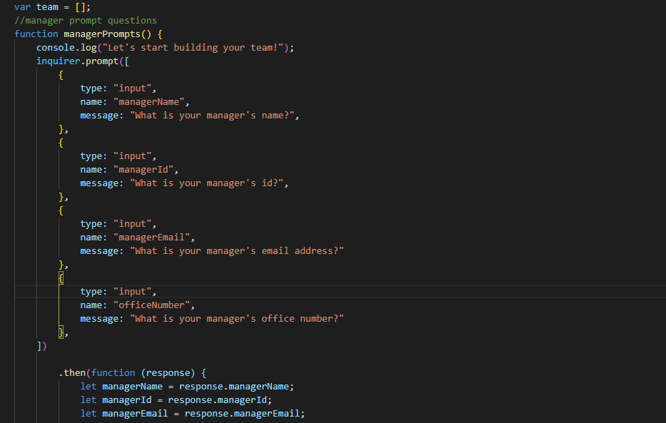
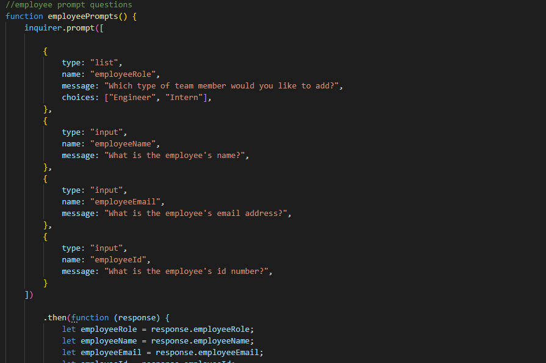

# Template-Engine---Employee-Summary
 ## Description 
 The Template Engine Employee Summary was a project where we had to build a software engineering team generator command line application. The application prompts the user for information about the team manager and then information about the team members. The user can input any number of team members, and they may be a mix of engineers and interns. We were also required to pass all unit tests. When the user has completed building the team, the application will create an HTML file that displays a nicely formatted team roster based on the information provided by the user.
 
## Process
  The first step was to install node and to make sure that all of the tests passed. The dependencies were jest, for running the provided tests, and inquirer for collecting input from the user. I worked on creating classes and simple methods to make testing easier for the Manager, Engineer and Intern section. Lastly, I worked on the app.js file to create the prompts and appropriate functions. This was a very interesting project to see my app run as a Node CLI to gather information about each employee. This is a creative way collect data on team members and present them in a very neat card format with their contact info. 
  Here's a link to my Screencastify where I demo the Template Engine Employee Summary [Link to demo](https://drive.google.com/file/d/1-PVTYw_442JswuU7_nPjHEeAG8ojdN7N/view). Please see below for some snippets:

 My Template Engine Employee Summary that got generated from Git Bash:

 
 Snippet of the prompts that pop up in the terminal:
 
 Snippet of the app.js code:
 
 

 ## Installation
 You will need VS code and the dependencies are inquirer and jest.
 
 ## Usage 
 A command-line application will allow for quick and easy generation of Employee Summary information. This allows an employer or manager to produce a clean simple looking information card on each team member.

 ## Tests
 Open VS code, right click and open in integrated terminal. Type node app.js and run the file. Answer all the prompts and it will quickly plug in all of your data into the html code and generate the appropriate cards on the browser. 
 

### Installing/Technology Used

The following platforms were required to build this website:

1) VS code
2) GitBash/Terminal
3) GitLab
4) GitHub
5) Jest
6) Inquirer

## Built With

* [Node.js](https://nodejs.dev/learn/the-package-json-guide)
* [jest](https://jestjs.io/)
* [inquirer](https://www.npmjs.com/package/inquirer)

 ## Authors

* **Kelly Kim** 

- [Link to Github](https://github.com/kellykim831)
- [Link to LinkedIn](https://www.linkedin.com/in/realtorkellykim/)
- [Link to Facebook](https://www.facebook.com/kimkelz)

## Acknowledgments

* [Link to Google](https://www.google.com)
* [Link to W3 Schools](https://www.w3schools.com)
* [Link to StackOverflow](https://www.stackoverflow.com)
* [Link to Node.js](https://nodejs.org/en/)